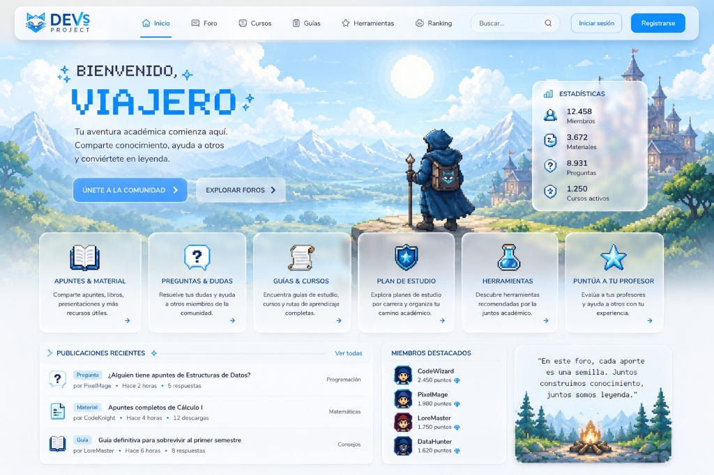

# 🐺 DEVs PROJECT - Foro Universitario



> _"En este foro, cada aporte es una semilla. Juntos construimos conocimiento, juntos somos leyenda."_

## 📋 Descripción General

**DEVs PROJECT** es una plataforma web comunitaria para estudiantes universitarios con temática RPG/pixel-art. Funciona como foro, repositorio de materiales académicos, sistema de ranking gamificado y herramientas colaborativas para la vida universitaria.

---

## 🎯 Módulos Principales

| # | Módulo | Descripción |
|---|--------|-------------|
| 1 | **Foro de Preguntas & Dudas** | Sistema Q&A estilo StackOverflow con categorías por materia |
| 2 | **Apuntes & Material** | Subida/descarga de apuntes, libros, presentaciones con previews |
| 3 | **Guías & Cursos** | Rutas de aprendizaje y guías paso a paso creadas por la comunidad |
| 4 | **Plan de Estudio** | Explorador de planes de estudio por carrera, organización semestral |
| 5 | **Herramientas** | Colección de herramientas recomendadas por la comunidad |
| 6 | **Puntúa a tu Profesor** | Sistema de evaluación anónima de profesores |
| 7 | **Ranking & Gamificación** | Sistema de puntos, badges, niveles RPG por participación |

---

## 🏗️ Arquitectura del Proyecto

```
┌─────────────────────────────────────────────────────┐
│                   CLIENTE (Browser)                  │
│         Next.js 15 + React 19 + TypeScript           │
└──────────────────────┬──────────────────────────────┘
                       │ HTTPS / WebSocket
                       ▼
┌─────────────────────────────────────────────────────┐
│                  REVERSE PROXY                       │
│                Nginx / Caddy                         │
│          (SSL, Rate Limiting, Cache)                 │
└──────────────────────┬──────────────────────────────┘
                       │
                       ▼
┌─────────────────────────────────────────────────────┐
│                  BACKEND API                         │
│              NestJS (Node.js)                        │
│               TypeScript + REST                      │
│          (Auth, Validation, Business Logic)           │
└───────┬──────────┬──────────┬───────────────────────┘
        │          │          │
        ▼          ▼          ▼
   ┌─────────┐ ┌────────┐ ┌──────────┐
   │PostgreSQL│ │ Redis  │ │ Storage  │
   │  (Data)  │ │(Cache/ │ │(Archivos │
   │          │ │Session)│ │ /Media)  │
   └─────────┘ └────────┘ └──────────┘
```

---

## 🔧 Stack Tecnológico Recomendado

### Frontend
| Tecnología | Versión | Justificación |
|-----------|---------|---------------|
| **Next.js** | 15.x | SSR/SSG, SEO, App Router, rendimiento |
| **React** | 19.x | Composición, ecosistema maduro |
| **TypeScript** | 5.x | Tipado estático, mejor DX y seguridad |
| **CSS Modules + Vanilla CSS** | - | Máximo control, sin dependencias extra |
| **Framer Motion** | 12.x | Animaciones fluidas (micro-animations) |
| **React Query (TanStack)** | 5.x | Cache de datos del servidor, refetch inteligente |
| **Zustand** | 5.x | Estado global liviano |
| **Socket.io Client** | 4.x | Notificaciones en tiempo real |

### Backend
| Tecnología | Versión | Justificación |
|-----------|---------|---------------|
| **NestJS** | 11.x | Framework enterprise con arquitectura modular, DI, decoradores |
| **Node.js** | 22 LTS | Runtime rápido, mismo lenguaje que front |
| **TypeScript** | 5.x | Consistencia con frontend (NestJS es TS nativo) |
| **Prisma ORM** | 6.x | Type-safe queries, migraciones, seeding |
| **@nestjs/websockets** | 11.x | WebSockets integrados para notificaciones en tiempo real |
| **@nestjs/bull** | 11.x | Cola de trabajos (envío de emails, procesamiento) |
| **Nodemailer** | 6.x | Envío de emails transaccionales |
| **Sharp** | 0.33.x | Procesamiento de imágenes (thumbnails, compresión) |
| **class-validator + class-transformer** | — | Validación con decoradores (estilo NestJS) |

### Base de Datos & Cache
| Tecnología | Justificación |
|-----------|---------------|
| **PostgreSQL 16** | Relacional robusto, full-text search nativo, JSONB |
| **Redis 7** | Cache, sesiones, rate limiting, pub/sub en tiempo real |

### DevOps & Infraestructura (VPS)
| Tecnología | Justificación |
|-----------|---------------|
| **Ubuntu 24.04 LTS** | Estable, bien documentado para VPS |
| **Docker + Docker Compose** | Contenedores reproducibles para cada servicio |
| **Nginx** | Reverse proxy, SSL termination, serving de archivos estáticos |
| **Let's Encrypt / Certbot** | Certificados SSL gratuitos y auto-renovables |
| **GitHub Actions** | CI/CD: lint, test, build, deploy automático |
| **PM2** | Process manager para Node.js en producción |

### VPS Recomendado
| Proveedor | Plan Mínimo | Especificaciones |
|-----------|-------------|------------------|
| **Hetzner** | CX22 | 2 vCPU, 4GB RAM, 40GB SSD — ~€4.5/mes |
| **Contabo** | VPS S | 4 vCPU, 8GB RAM, 200GB SSD — ~€5.99/mes |
| **DigitalOcean** | Basic | 2 vCPU, 4GB RAM, 80GB SSD — ~$24/mes |
| **Hostinger** | KVM 2 | 2 vCPU, 8GB RAM, 100GB SSD — ~$10/mes |

> [!TIP]
> Para un proyecto universitario, **Hetzner** o **Contabo** ofrecen la mejor relación calidad/precio. Con 4GB RAM es suficiente para iniciar con PostgreSQL + Redis + Node.js + Nginx en Docker.

---

## 👥 Roles del Sistema

| Rol | Permisos |
|-----|----------|
| **Visitante** | Ver contenido público, buscar, registrarse |
| **Estudiante** | Publicar, comentar, votar, subir material, evaluar profesores |
| **Moderador** | Todo lo de Estudiante + moderar contenido, silenciar usuarios |
| **Administrador** | Todo lo de Moderador + gestión de aterías, carreras, configuración del sitio |
| **Super Admin** | Acceso total al sistema, gestión de roles, panel de administración |

---

## 📂 Estructura del Proyecto

```
Devs_FORO/
├── docs/                          # Documentación del proyecto
│   ├── README_FRONTEND.md         # Plan del equipo Frontend
│   ├── README_BACKEND.md          # Plan del equipo Backend
│   ├── README_DATABASE.md         # Plan del equipo Base de Datos
│   ├── README_TESTING.md          # Plan del equipo Testing/QA
│   ├── README_SECURITY.md         # Plan del equipo Seguridad
│   ├── README_DEVOPS.md           # Plan del equipo DevOps
│   ├── README_PROJECT_MANAGEMENT.md # Gestión y metodología
│   └── assets/                    # Diagramas, mockups
├── frontend/                      # Aplicación Next.js (futuro)
├── backend/                       # API Fastify (futuro)
├── database/                      # Migraciones y seeds (futuro)
├── docker/                        # Dockerfiles y docker-compose
├── .github/                       # CI/CD workflows
└── README.md                      # Este archivo
```

---

## 📖 Documentación por Área

| Documento | Equipo | Contenido |
|-----------|--------|-----------|
| [README_FRONTEND.md](docs/README_FRONTEND.md) | Frontend | Componentes, páginas, diseño, animaciones |
| [README_BACKEND.md](docs/README_BACKEND.md) | Backend | API, lógica de negocio, autenticación |
| [README_DATABASE.md](docs/README_DATABASE.md) | Base de Datos | Modelos, relaciones, migraciones, índices |
| [README_TESTING.md](docs/README_TESTING.md) | QA/Testing | Unit tests, E2E, testing manual, cobertura |
| [README_SECURITY.md](docs/README_SECURITY.md) | Seguridad | Auth, validaciones, protecciones, OWASP |
| [README_DEVOPS.md](docs/README_DEVOPS.md) | DevOps | Docker, CI/CD, VPS, deploy, monitoreo |
| [README_PROJECT_MANAGEMENT.md](docs/README_PROJECT_MANAGEMENT.md) | Gestión | Metodología, sprints, comunicación |
| [README_RULES.md](docs/README_RULES.md) | Todo el equipo | Reglas de código, convenciones de nombres, arquitectura |

---

## 🚀 Próximos Pasos

1. Revisar y aprobar este plan general y los planes por área
2. Configurar repositorio Git con ramas por área
3. Configurar entorno de desarrollo con Docker Compose
4. Sprint 0: Setup base del frontend y backend
5. Sprint 1: Autenticación + página de inicio
6. Sprint 2: Foro de preguntas + sistema de materiales

---

## 📜 Licencia

Este proyecto es de código abierto para la comunidad universitaria.

---

*Hecho con 🐺 por el equipo DEVs PROJECT*
