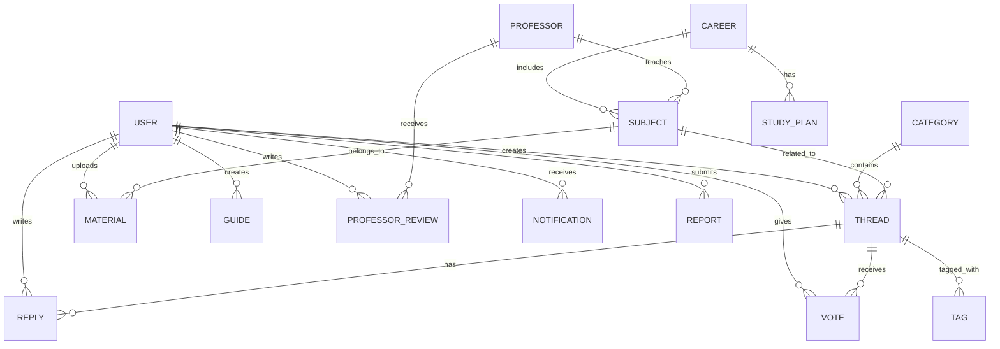

# 🗄️ DEVs PROJECT — Plan de Base de Datos

> Documento de planificación para el equipo de Base de Datos.

## 📐 Stack

| Tecnología | Uso |
|-----------|-----|
| PostgreSQL 16 | Base de datos relacional principal |
| Redis 7 | Cache, sesiones, rate limiting, pub/sub |
| Prisma 6 | ORM, migraciones, seeding |

## 📊 Modelo de Datos (Entidades)

### Diagrama Entidad-Relación



### Tablas Principales

#### `users`
| Columna | Tipo | Descripción |
|---------|------|-------------|
| id | UUID (PK) | Identificador único |
| username | VARCHAR(30) UNIQUE | Nombre de usuario |
| email | VARCHAR(255) UNIQUE | Email institucional preferido |
| password_hash | VARCHAR(255) | Bcrypt hash |
| display_name | VARCHAR(50) | Nombre visible |
| avatar_url | VARCHAR(500) | URL del avatar |
| bio | TEXT | Biografía corta |
| role | ENUM | visitor/student/moderator/admin/superadmin |
| points | INT DEFAULT 0 | Puntos de gamificación |
| level | INT DEFAULT 1 | Nivel RPG |
| email_verified | BOOLEAN | Email verificado |
| is_banned | BOOLEAN | Usuario baneado |
| is_muted | BOOLEAN | Usuario silenciado |
| muted_until | TIMESTAMP | Fin del silencio temporal |
| career_id | UUID (FK) | Carrera del estudiante |
| created_at | TIMESTAMP | Fecha de registro |
| updated_at | TIMESTAMP | Última actualización |
| last_login | TIMESTAMP | Último login |

#### `categories`
| Columna | Tipo | Descripción |
|---------|------|-------------|
| id | UUID (PK) | ID |
| name | VARCHAR(100) | Nombre de la categoría |
| slug | VARCHAR(100) UNIQUE | URL amigable |
| description | TEXT | Descripción |
| icon | VARCHAR(50) | Nombre del icono |
| color | VARCHAR(7) | Color hex |
| order | INT | Orden de visualización |
| thread_count | INT DEFAULT 0 | Counter cache |
| is_active | BOOLEAN | Activa/inactiva |

#### `threads`
| Columna | Tipo | Descripción |
|---------|------|-------------|
| id | UUID (PK) | ID |
| title | VARCHAR(200) | Título del hilo |
| slug | VARCHAR(250) UNIQUE | URL amigable |
| content | TEXT | Contenido (Markdown) |
| type | ENUM | question/material/guide/discussion |
| author_id | UUID (FK → users) | Autor |
| category_id | UUID (FK → categories) | Categoría |
| subject_id | UUID (FK → subjects) | Materia relacionada |
| vote_count | INT DEFAULT 0 | Counter cache votos |
| reply_count | INT DEFAULT 0 | Counter cache respuestas |
| view_count | INT DEFAULT 0 | Vistas |
| is_pinned | BOOLEAN | Hilo fijado |
| is_locked | BOOLEAN | Hilo bloqueado |
| is_solved | BOOLEAN | Pregunta resuelta |
| solved_reply_id | UUID (FK) | Respuesta aceptada |
| created_at | TIMESTAMP | Fecha creación |
| updated_at | TIMESTAMP | Última edición |

#### `replies`
| Columna | Tipo | Descripción |
|---------|------|-------------|
| id | UUID (PK) | ID |
| content | TEXT | Contenido (Markdown) |
| author_id | UUID (FK → users) | Autor |
| thread_id | UUID (FK → threads) | Hilo padre |
| parent_id | UUID (FK → replies) | Respuesta padre (anidado) |
| vote_count | INT DEFAULT 0 | Counter cache |
| is_accepted | BOOLEAN | Respuesta aceptada |
| created_at | TIMESTAMP | |
| updated_at | TIMESTAMP | |

#### `votes`
| Columna | Tipo | Descripción |
|---------|------|-------------|
| id | UUID (PK) | ID |
| user_id | UUID (FK) | Quién votó |
| thread_id | UUID (FK, nullable) | Hilo votado |
| reply_id | UUID (FK, nullable) | Respuesta votada |
| value | SMALLINT | +1 o -1 |
| created_at | TIMESTAMP | |
| UNIQUE(user_id, thread_id) | | Un voto por usuario por hilo |
| UNIQUE(user_id, reply_id) | | Un voto por usuario por respuesta |

#### `materials`
| Columna | Tipo | Descripción |
|---------|------|-------------|
| id | UUID (PK) | ID |
| title | VARCHAR(200) | Título |
| description | TEXT | Descripción |
| file_url | VARCHAR(500) | Ruta del archivo |
| file_type | VARCHAR(20) | pdf/doc/ppt/img/zip |
| file_size | BIGINT | Tamaño en bytes |
| thumbnail_url | VARCHAR(500) | Miniatura generada |
| author_id | UUID (FK) | Quien lo subió |
| subject_id | UUID (FK) | Materia |
| download_count | INT DEFAULT 0 | Descargas |
| avg_rating | DECIMAL(3,2) | Promedio de valoración |
| rating_count | INT DEFAULT 0 | Cantidad de valoraciones |
| is_approved | BOOLEAN | Aprobado por mod |
| created_at | TIMESTAMP | |

#### `guides`, `professors`, `professor_reviews`, `careers`, `subjects`, `study_plans`, `tags`, `notifications`, `reports`
> Siguen patrones similares. Ver schema completo en `prisma/schema.prisma`.

## 🔍 Índices Importantes

```sql
-- Búsqueda full-text
CREATE INDEX idx_threads_search ON threads USING GIN (
  to_tsvector('spanish', title || ' ' || content)
);
CREATE INDEX idx_materials_search ON materials USING GIN (
  to_tsvector('spanish', title || ' ' || description)
);

-- Consultas frecuentes
CREATE INDEX idx_threads_category ON threads(category_id, created_at DESC);
CREATE INDEX idx_threads_author ON threads(author_id);
CREATE INDEX idx_replies_thread ON replies(thread_id, created_at);
CREATE INDEX idx_votes_user_thread ON votes(user_id, thread_id);
CREATE INDEX idx_materials_subject ON materials(subject_id);
CREATE INDEX idx_users_points ON users(points DESC);
CREATE INDEX idx_notifications_user ON notifications(user_id, read, created_at DESC);
```

## 🔄 Redis - Uso Planificado

| Key Pattern | TTL | Uso |
|-------------|-----|-----|
| `session:{userId}` | 7 días | Refresh tokens |
| `user:{id}` | 15 min | Cache de perfil |
| `thread:{id}:views` | — | Contador de vistas (flush a PG cada 5 min) |
| `ranking:global` | 5 min | Cache ranking global |
| `ranking:weekly` | 5 min | Cache ranking semanal |
| `ratelimit:{ip}` | 1 min | Rate limiting |
| `email:verify:{token}` | 24h | Tokens de verificación |
| `password:reset:{token}` | 1h | Tokens de reset |
| `search:popular` | 1h | Búsquedas populares |

## 📋 Tareas del Equipo Base de Datos

### Sprint 0 — Diseño y Setup

| # | Tarea | Tipo | Dependencias |
|---|-------|------|--------------|
| DB-001 | Diseñar schema completo en Prisma | 🔵 Solo | — |
| DB-002 | Crear modelo `users` + migración | 🔵 Solo | DB-001 |
| DB-003 | Crear modelos `categories`, `threads`, `replies`, `votes` | 🔵 Solo | DB-001 |
| DB-004 | Crear modelo de puntos y niveles | 🔵 Solo | DB-001 |
| DB-005 | Configurar índices full-text search | 🔵 Solo | DB-003 |
| DB-006 | Crear modelos `materials`, `ratings` | 🔵 Solo | DB-001 |
| DB-007 | Crear modelos `guides`, `guide_steps` | 🔵 Solo | DB-001 |
| DB-008 | Crear modelos `professors`, `reviews` | 🔵 Solo | DB-001 |
| DB-009 | Crear modelos `careers`, `subjects`, `study_plans` | 🔵 Solo | DB-001 |
| DB-010 | Crear modelos `notifications`, `reports`, `tags` | 🔵 Solo | DB-001 |

### Sprint 1 — Seeds y Optimización

| # | Tarea | Tipo | Dependencias |
|---|-------|------|--------------|
| DB-011 | Crear seed de datos de desarrollo | 🔵 Solo | DB-002...DB-010 |
| DB-012 | Crear seed de carreras/materias reales | 🟠 Conjunto (equipo) | DB-009 |
| DB-013 | Configurar Redis en Docker | 🟠 Conjunto (DevOps) | **DO-001** |
| DB-014 | Documentar queries complejas | 🔵 Solo | DB-005 |
| DB-015 | Configurar backups automáticos | 🟠 Conjunto (DevOps) | **DO-006** |

## 🔑 Leyenda

| Icono | Tipo |
|-------|------|
| 🔵 Solo | Independiente |
| 🟢 Paralelo | Simultáneo |
| 🟠 Conjunto | Requiere coordinación |

> [!IMPORTANT]
> El equipo de DB debe tener el schema de Prisma listo **antes** de que Backend empiece el Sprint 1. Deben coordinarse para validar modelos y relaciones.

---
*📅 Última actualización: Julio 2026*
