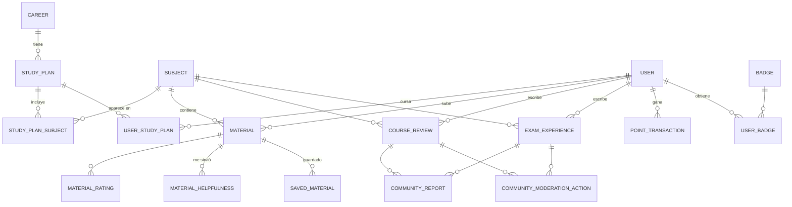

# Base de datos

PostgreSQL con Prisma 7. La fuente de verdad es `apps/backend/prisma/schema.prisma`; este documento explica cómo está organizado y qué falta para lo que ya está especificado. Los nombres del dominio siguen [`CONTEXT.md`](../CONTEXT.md).

No hay Redis: sesiones, tokens y contadores viven en Postgres.

## Mapa del modelo


```mermaid
erDiagram
    CAREER ||--o{ STUDY_PLAN : tiene
    STUDY_PLAN ||--o{ STUDY_PLAN_SUBJECT : incluye
    SUBJECT ||--o{ STUDY_PLAN_SUBJECT : "aparece en"
    USER ||--o{ USER_STUDY_PLAN : cursa
    STUDY_PLAN ||--o{ USER_STUDY_PLAN : ""

    SUBJECT ||--o{ MATERIAL : contiene
    USER ||--o{ MATERIAL : sube
    MATERIAL ||--o{ MATERIAL_RATING : ""
    MATERIAL ||--o{ MATERIAL_HELPFULNESS : "me sirvió"
    MATERIAL ||--o{ SAVED_MATERIAL : guardado

    SUBJECT ||--o{ COURSE_REVIEW : ""
    SUBJECT ||--o{ EXAM_EXPERIENCE : ""
    USER ||--o{ COURSE_REVIEW : escribe
    USER ||--o{ EXAM_EXPERIENCE : escribe
    COURSE_REVIEW ||--o{ COMMUNITY_REPORT : ""
    EXAM_EXPERIENCE ||--o{ COMMUNITY_REPORT : ""
    COURSE_REVIEW ||--o{ COMMUNITY_MODERATION_ACTION : ""
    EXAM_EXPERIENCE ||--o{ COMMUNITY_MODERATION_ACTION : ""

    USER ||--o{ POINT_TRANSACTION : gana
    USER ||--o{ USER_BADGE : obtiene
    BADGE ||--o{ USER_BADGE : ""
```

## Modelos por área

| Área | Modelos | Notas |
|---|---|---|
| Cuentas | `User`, `RefreshToken`, `EmailVerification`, `PasswordResetRequest` | Tokens guardados hasheados. `User` ya tiene `isBanned`, `isMuted`, `mutedUntil`, pero no hay lógica que los use. |
| Plan de estudios | `Career`, `StudyPlan`, `StudyPlanSubject`, `Subject`, `UserStudyPlan` | La materia se vincula al **plan**, no a la carrera (ver abajo). |
| Recursos | `Material`, `MaterialRating`, `MaterialHelpfulness`, `SavedMaterial` | `Material` guarda el contexto de cursada (`resourceType`, `academicYear`, `professorId`, `shift`), el estado de moderación y los datos del archivo (Drive o staging local). |
| Comunidad | `CourseReview`, `ExamExperience` | Publicación anónima con `isAnonymous`; retiro reversible con `isRemoved`, `removedReason`, `removedAt`, `removedById`. |
| Moderación comunitaria | `CommunityReport`, `CommunityModerationAction` | Un reporte apunta a una reseña **o** a una experiencia. Cada retiro o restauración queda registrado con su motivo. |
| Moderación de materiales | `ModerationLog` (+ enum `ModerationAction`) | Registro de aprobaciones y rechazos. Incluye acciones de ban, mute y guías que nunca se implementaron. |
| Puntos | `PointTransaction`, `User.points`, `User.level` | Libro de movimientos; `points` es el total acumulado. |
| Insignias | `Badge`, `UserBadge` | Tablas creadas, sin datos ni lógica. |
| Heredado | `Professor`, `SubjectProfessor`, `Guide`, `GuideStep` | `Professor` sigue en uso como dato de contexto (quién dictó o tomó). Las guías y las páginas de profesores salieron del producto. |

### Enums relevantes

- `Role`: VISITOR, USER, MODERATOR, ADMIN, SUPERADMIN.
- Contexto de cursada: `Shift`, `CourseCondition`, `CourseAttempt`, `CommunityDifficulty`.
- Finales: `ExamSession`, `ExamFormat`, `ExamOutcome`.
- Recursos: `MaterialResourceType` (PARCIAL, FINAL, APUNTE, RESUMEN, TRABAJO_PRACTICO, GUIA_EJERCICIOS, OTRO) y `MaterialModerationStatus` (PENDING, APPROVED, REJECTED).
- Reportes: `CommunityReportReason` (SPAM_O_REPETIDO, INSULTOS_O_ACOSO, DATOS_PERSONALES, NO_RELACIONADO, POSIBLEMENTE_ENGANOSO, OTRO).

## Preguntas de diseño resueltas

Estas dudas estaban anotadas en el antiguo `README_DATABASE_MODELO.md`.

**¿Por qué la materia se vincula al plan y no a la carrera?** Una misma carrera cambia de plan (Plan 2011, Plan 2023) y la materia puede cambiar de año, de cuatrimestre o desaparecer. `StudyPlanSubject` guarda `year`, `semester` y `credits` para cada plan. Una materia compartida por varias carreras aparece en varios planes sin duplicarse.

**¿Un estudiante puede tener más de una carrera?** Sí. `UserStudyPlan` es la tabla estudiante–plan, con estado ACTIVE, COMPLETED o DROPPED. Reemplazó al `career_id` único del diseño original.

**¿Hace falta una tabla para valorar materiales?** Sí, y existe: `MaterialRating` guarda una valoración de 1 a 5 por usuario y material (único por par), con comentario opcional. `Material.avgRating` y `ratingCount` son un caché de esa tabla. El «Me sirvió» es aparte (`MaterialHelpfulness`) y es la señal principal que se muestra.

## Lo que falta para las especificaciones

| Especificación | Cambios en el esquema |
|---|---|
| [Moderación](README_MODERACION.md) y [ADR 0001](adr/0001-publicacion-inmediata-con-moderacion-posterior.md) | Caso de moderación que agrupe reportes de cualquier contenido (materiales, reseñas, experiencias, eventos, avisos); ocultamiento preventivo; sanciones con vencimiento; apelaciones; registro de «Ver autor» con motivo; `Material` publicado por defecto. |
| Alcance por facultad | No existen `University` ni `Faculty`; la carrera no sabe a qué facultad pertenece. Hace falta para moderadores por facultad y para la navegación Universidad → Facultad → Carrera del rediseño. |
| [Puntos e insignias](README_PUNTOS_E_INSIGNIAS.md) | Códigos de motivo nuevos (`MATERIAL_PUBLISHED`, `EVENT_PUBLISHED`, reversiones); catálogo de insignias con clave estable; privilegios por nivel. |
| Formularios de experiencias | Nota de promoción, temas y preparación del final, datos de la mesa; `academicYear`, `attempt` y `outcome` pasan a ser obligatorios según el formulario. |
| Eventos y Clasificados | Modelos nuevos (evento, «Me interesa», organizador verificado; aviso de venta y de tutoría). |

## Migraciones

```
20260718225826_add_auth_fields
20260726022757_remove_forum_setup_app            quita el foro
20260807003124_add_point_transactions
20260812000000_add_reviews_and_moderation
20260828090000_add_material_context_and_interactions
20260828100000_expand_community_evidence
20260828110000_add_community_reporting_and_moderation
```

Flujo de trabajo:

```bash
pnpm --filter backend exec prisma migrate dev --name <cambio>   # crea y aplica
pnpm --filter backend exec prisma generate                      # cliente en src/generated/prisma
pnpm --filter backend exec prisma db seed                       # datos de ejemplo (prisma/seed.ts)
```

- Las migraciones que transforman datos llevan una prueba en `prisma/migration-tests/` (se corren con `pnpm --filter backend test:migration:<nombre>`).
- Los rellenos de datos van en `prisma/backfills/`.
- Nunca editar una migración ya aplicada en otra máquina: crear una nueva.
