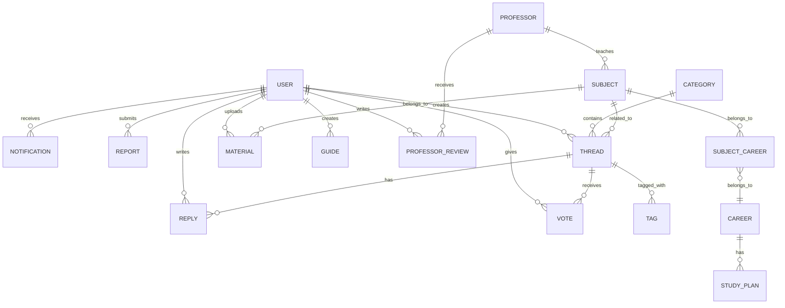

# Esquema de Base de Datos

Tengo dudas sobre el diseño de la base de datos, en especial sobre la relación entre **carreras, planes de estudio y materias** (por qué conviene vincular la materia al plan y no directamente a la carrera). Y si me hace que hace falta una tabla para la **valoración de materiales**.

| columna      | tipo          | relacion                 |
| ------------ | ------------- | ------------------------ |
| avg_rating   | DECIMAL(3,2)  | Promedio de valoración   |
| rating_count | INT DEFAULT 0 | Cantidad de valoraciones |
Esos datos requieren que se guarden las votaciones. Ademas tampoco me dice la relacion de como valorar, X/?, basicamente eso.

Tengo dudas sobre cuáles son los atributos esenciales que deberían llevar las tablas de **profesores, sus calificaciones, materias, guías, carreras y reportes, notificaciones etc**.
Trate de hacerlo simple, pero asi fui modificando. 

==Importante, tambien note que USERS solo se le permite tener una carrera, lo cual esta mal, se podria cambiar agregando una tea carrera-estudiante, pero no se si aumentara la complejidad, dejando eso a un lado el grafico tambien necesita revision por que no esta esta conexion.==

Falta revisión. 
#### `users`

| Columna        | Tipo                | Descripción                                |
| -------------- | ------------------- | ------------------------------------------ |
| id             | UUID (PK)           | Identificador único                        |
| username       | VARCHAR(30) UNIQUE  | Nombre de usuario                          |
| email          | VARCHAR(255) UNIQUE | Email institucional preferido              |
| password_hash  | VARCHAR(255)        | Bcrypt hash                                |
| display_name   | VARCHAR(50)         | Nombre visible                             |
| avatar_url     | VARCHAR(500)        | URL del avatar                             |
| bio            | TEXT                | Biografía corta                            |
| role           | ENUM                | visitor/student/moderator/admin/superadmin |
| points         | INT DEFAULT 0       | Puntos de gamificación                     |
| level          | INT DEFAULT 1       | Nivel RPG                                  |
| email_verified | BOOLEAN             | Email verificado                           |
| is_banned      | BOOLEAN             | Usuario baneado                            |
| is_muted       | BOOLEAN             | Usuario silenciado                         |
| muted_until    | TIMESTAMP           | Fin del silencio temporal                  |
| career_id      | UUID (FK → careers) | Carrera del estudiante                     |
| created_at     | TIMESTAMP           | Fecha de registro                          |
| updated_at     | TIMESTAMP           | Última actualización                       |
| last_login     | TIMESTAMP           | Último login                               |

#### `categories`

| Columna       | Tipo                | Descripción            |
| ------------- | ------------------- | ---------------------- |
| id            | UUID (PK)           | ID                     |
| name          | VARCHAR(100)        | Nombre de la categoría |
| slug          | VARCHAR(100) UNIQUE | URL amigable           |
| description   | TEXT                | Descripción            |
| icon          | VARCHAR(50)         | Nombre del icono       |
| color         | VARCHAR(7)          | Color hex              |
| order_display | INT                 | Orden de visualización |
| thread_count  | INT DEFAULT 0       | Counter cache          |
| is_active     | BOOLEAN             | Activa/inactiva        |

#### `threads`

| Columna         | Tipo                   | Descripción                        |
| --------------- | ---------------------- | ---------------------------------- |
| id              | UUID (PK)              | ID                                 |
| title           | VARCHAR(200)           | Título del hilo                    |
| slug            | VARCHAR(250) UNIQUE    | URL amigable                       |
| content         | TEXT                   | Contenido (Markdown)               |
| type            | ENUM                   | question/material/guide/discussion |
| author_id       | UUID (FK → users)      | Autor                              |
| category_id     | UUID (FK → categories) | Categoría                          |
| subject_id      | UUID (FK → subjects)   | Materia relacionada                |
| vote_count      | INT DEFAULT 0          | Counter cache votos                |
| reply_count     | INT DEFAULT 0          | Counter cache respuestas           |
| view_count      | INT DEFAULT 0          | Vistas                             |
| is_pinned       | BOOLEAN                | Hilo fijado                        |
| is_locked       | BOOLEAN                | Hilo bloqueado                     |
| is_solved       | BOOLEAN                | Pregunta resuelta                  |
| solved_reply_id | UUID (FK → replies)    | Respuesta aceptada                 |
| created_at      | TIMESTAMP              | Fecha creación                     |
| updated_at      | TIMESTAMP              | Última edición                     |

#### `replies`

| Columna | Tipo | Descripción |
| --- | --- | --- |
| id | UUID (PK) | ID |
| content | TEXT | Contenido (Markdown) |
| author_id | UUID (FK → users) | Autor |
| thread_id | UUID (FK → threads) | Hilo padre |
| parent_id | UUID (FK → replies) | Respuesta padre (anidado) |
| vote_count | INT DEFAULT 0 | Counter cache |
| is_accepted | BOOLEAN | Respuesta aceptada |
| created_at | TIMESTAMP | Fecha creación |
| updated_at | TIMESTAMP | Última edición |

#### `votes`

| Columna | Tipo | Descripción |
| --- | --- | --- |
| id | UUID (PK) | ID |
| user_id | UUID (FK → users) | Quién votó |
| thread_id | UUID (FK → threads, nullable) | Hilo votado |
| reply_id | UUID (FK → replies, nullable) | Respuesta votada |
| value | SMALLINT | +1 o -1 |
| created_at | TIMESTAMP | Fecha creación |
| UNIQUE(user_id, thread_id) | Constraint | Un voto por usuario por hilo |
| UNIQUE(user_id, reply_id) | Constraint | Un voto por usuario por respuesta |

#### `materials`

| Columna | Tipo | Descripción |
| --- | --- | --- |
| id | UUID (PK) | ID |
| title | VARCHAR(200) | Título |
| description | TEXT | Descripción |
| file_url | VARCHAR(500) | Ruta del archivo |
| file_type | VARCHAR(20) | pdf/doc/ppt/img/zip |
| file_size | BIGINT | Tamaño en bytes |
| thumbnail_url | VARCHAR(500) | Miniatura generada |
| author_id | UUID (FK → users) | Quien lo subió |
| subject_id | UUID (FK → subjects) | Materia |
| download_count | INT DEFAULT 0 | Descargas |
| avg_rating | DECIMAL(3,2) | Promedio de valoración |
| rating_count | INT DEFAULT 0 | Cantidad de valoraciones |
| is_approved | BOOLEAN | Aprobado por mod |
| created_at | TIMESTAMP | Fecha creación |

#### `reports`

| Columna        | Tipo                        | Descripción                                                 |
| -------------- | --------------------------- | ----------------------------------------------------------- |
| id             | UUID (PK)                   | Identificador único                                         |
| reporter_id    | UUID (FK → users)           | Usuario que realiza el reporte                              |
| target_type    | ENUM                        | thread/reply/user/professor/guide/material/professor_review |
| target_id      | UUID                        | ID del elemento reportado (Polimórfico)                     |
| reason         | ENUM                        | spam/inappropriate/harassment/copyright/other               |
| description    | TEXT                        | Comentario o detalle adicional                              |
| status         | ENUM                        | pending/approved/rejected/resolved (DEFAULT 'pending')      |
| reviewed_by_id | UUID (FK → users, nullable) | Moderador/Admin que revisó el reporte                       |
| reviewed_at    | TIMESTAMP                   | Fecha de revisión                                           |
| created_at     | TIMESTAMP                   | Fecha de creación                                           |
| updated_at     | TIMESTAMP                   | Última actualización de estado                              |

#### `guides`

| Columna      | Tipo                           | Descripción                   |
| ------------ | ------------------------------ | ----------------------------- |
| id           | UUID (PK)                      | Identificador de la guía      |
| author_id    | UUID (FK → users)              | Autor de la guía              |
| title        | VARCHAR(25)                    | Título de la guía             |
| description  | VARCHAR(200)                   | Breve resumen                 |
| content      | TEXT                           | Contenido completo (Markdown) |
| view_count   | INT DEFAULT 0                  | Contador de visualizaciones   |
| is_published | BOOLEAN DEFAULT true           | Estado de publicación         |
| created_at   | TIMESTAMP                      | Fecha de creación             |
| updated_at   | TIMESTAMP                      | Última modificación           |
| slug         | VARCHAR(250) UNIQUE            | URL amigable                  |

#### `professor_reviews`

| Columna                       | Tipo                   | Descripción                                          |
| ----------------------------- | ---------------------- | ---------------------------------------------------- |
| id                            | UUID (PK)              | Identificador único                                  |
| user_id                       | UUID (FK → users)      | Usuario que realiza la reseña                        |
| professor_id                  | UUID (FK → professors) | Profesor valorado                                    |
| value                         | SMALLINT               | +1 (positivo) o -1 (negativo)                        |
| description                   | VARCHAR(200)           | Comentario del usuario                               |
| created_at                    | TIMESTAMP              | Fecha de creación                                    |
| updated_at                    | TIMESTAMP              | Última edición                                       |
| UNIQUE(user_id, professor_id) | Constraint             | Restricción: una valoración por usuario por profesor |

#### `careers`

| Columna | Tipo | Descripción |
| --- | --- | --- |
| id | UUID (PK) | Identificador único |
| name | VARCHAR(100) | Nombre de la carrera |
| code | VARCHAR(20) UNIQUE | Código o sigla académica |
| created_at | TIMESTAMP | Fecha de creación |
| updated_at | TIMESTAMP | Última actualización |

#### `study_plans`

| Columna | Tipo | Descripción |
| --- | --- | --- |
| id | UUID (PK) | Identificador único |
| career_id | UUID (FK → careers) | Carrera a la que pertenece |
| name | VARCHAR(150) | Nombre del plan (ej. "Plan 2023") |
| code | VARCHAR(50) | Código o resolución del plan |
| duration | SMALLINT | Duración estimada (en años o semestres) |
| created_at | TIMESTAMP | Fecha de creación |
| updated_at | TIMESTAMP | Última actualización |

#### `subjects`

| Columna      | Tipo                   | Descripción                               |
| ------------ | ---------------------- | ----------------------------------------- |
| id           | UUID (PK)              | Identificador único                       |
| professor_id | UUID (FK → professors) | Profesor que imparte materia              |
| name         | VARCHAR(150)           | Nombre de la materia                      |
| description  | TEXT                   | Descripción proporcionado por el profesor |

#### `subject_career`

| Columna    | Tipo                 | Descripción                 |
| ---------- | -------------------- | --------------------------- |
| id         | UUID (PK)            | Identificador único         |
| career_id  | UUID (FK → careers)  | Carrera a la que pertenece  |
| subject_id | UUID (FK → subjects) | Identificador de la materia |
