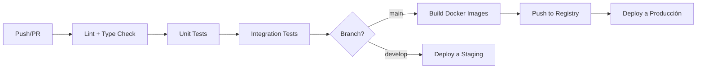

# 🚀 DEVs PROJECT — Plan de DevOps / Infraestructura

> Documento de planificación para el equipo de DevOps y despliegue en VPS.

## 📐 Stack de Infraestructura

| Tecnología | Uso |
|-----------|-----|
| Ubuntu 24.04 LTS | Sistema operativo del VPS |
| Docker + Docker Compose | Contenedores para cada servicio |
| Nginx | Reverse proxy, SSL, archivos estáticos |
| Let's Encrypt + Certbot | Certificados SSL gratuitos |
| GitHub Actions | CI/CD |
| PM2 | Process manager para Node.js |
| Watchtower (opcional) | Auto-update de contenedores |

## 🏗️ Arquitectura del VPS

```
┌──────────────── VPS (Ubuntu 24.04) ────────────────┐
│                                                      │
│  ┌─────────────────────────────────────────────┐    │
│  │                 Nginx (:80/:443)             │    │
│  │  SSL Termination + Reverse Proxy + Static   │    │
│  └───────┬─────────────────┬───────────────────┘    │
│          │                 │                         │
│    ┌─────▼──────┐   ┌─────▼──────┐                  │
│    │  Frontend   │   │  Backend   │                  │
│    │  Next.js    │   │  NestJS    │                  │
│    │  (:3000)    │   │  (:4000)   │                  │
│    └─────────────┘   └─────┬──────┘                  │
│                            │                         │
│          ┌─────────────────┼──────────────┐          │
│          │                 │              │          │
│    ┌─────▼──────┐   ┌─────▼──────┐ ┌─────▼──────┐  │
│    │ PostgreSQL  │   │   Redis    │ │  Uploads   │  │
│    │  (:5432)    │   │  (:6379)   │ │  (volume)  │  │
│    └─────────────┘   └────────────┘ └────────────┘  │
│                                                      │
└──────────────────────────────────────────────────────┘
```

## 🐳 Docker Compose (estructura)

```yaml
services:
  nginx:        # Reverse proxy + SSL
  frontend:     # Next.js app
  backend:      # Fastify API
  postgres:     # Base de datos
  redis:        # Cache y sesiones
  # Volúmenes: pg_data, redis_data, uploads, certbot
```

## 🔄 Pipeline CI/CD (GitHub Actions)



### Workflows necesarios:
1. **`ci.yml`** - Lint, type check, tests en cada PR
2. **`deploy-staging.yml`** - Deploy automático al mergear a `develop`
3. **`deploy-production.yml`** - Deploy manual/automático al mergear a `main`

## 🌿 Estrategia de Ramas Git

```
main          ── producción estable
  └── develop ── integración de features
       ├── feature/auth       ── feature individual
       ├── feature/forum      ── feature individual
       ├── feature/materials  ── feature individual
       ├── fix/login-bug      ── bugfix
       └── hotfix/security    ── fix urgente a producción
```

| Rama | Propósito | Merge a |
|------|-----------|---------|
| `main` | Producción estable | — |
| `develop` | Integración | `main` (release) |
| `feature/*` | Nueva funcionalidad | `develop` (PR) |
| `fix/*` | Corrección de bug | `develop` (PR) |
| `hotfix/*` | Fix urgente | `main` + `develop` |

## 🔧 Configuración del VPS

### Requisitos mínimos
- **CPU**: 2 vCPU
- **RAM**: 4 GB (mínimo) / 8 GB (recomendado)
- **SSD**: 40 GB+ (depende de archivos subidos)
- **OS**: Ubuntu 24.04 LTS

### Setup inicial del servidor
1. Crear usuario no-root con sudo
2. Configurar SSH con key-based auth (deshabilitar password)
3. Configurar firewall (UFW): solo 22, 80, 443
4. Instalar Docker + Docker Compose
5. Configurar Nginx + Let's Encrypt
6. Configurar swap (2 GB) si VPS tiene poca RAM
7. Configurar logrotate para logs

### Dominios y DNS
- `devsproject.com` → Frontend (Nginx → Next.js :3000)
- `api.devsproject.com` → Backend API (Nginx → Fastify :4000)
- Configurar registros A/AAAA apuntando al IP del VPS

## 📦 Backup Strategy

| Qué | Frecuencia | Retención | Destino |
|-----|------------|-----------|---------|
| PostgreSQL (pg_dump) | Diario 3AM | 7 días | S3/Backblaze B2 |
| Uploads (archivos) | Semanal | 4 semanas | S3/Backblaze B2 |
| Redis | No necesario (cache) | — | — |
| Configuración | En Git | ∞ | GitHub |

## 📊 Monitoreo

| Herramienta | Uso | Costo |
|-------------|-----|-------|
| Uptime Kuma | Monitoreo de uptime (self-hosted) | Gratis |
| htop/btop | Recursos del servidor | Gratis |
| Docker stats | Uso de contenedores | Gratis |
| Winston logs | Logging de aplicación | Gratis |
| Sentry (free tier) | Tracking de errores | Gratis (5k events/mes) |

## 📋 Tareas del Equipo DevOps

### Sprint 0 — Setup Infraestructura

| # | Tarea | Tipo | Dependencias |
|---|-------|------|--------------|
| DO-001 | Crear Docker Compose para desarrollo local | 🔵 Solo | — |
| DO-002 | Crear Dockerfiles (frontend, backend) | 🟠 Conjunto (Front+Back) | **F-001, B-001** |
| DO-003 | Crear workflow CI (lint + test) en GitHub Actions | 🔵 Solo | — |
| DO-004 | Configurar .env.example y manejo de secrets | 🔵 Solo | — |
| DO-005 | Configurar servicio de email (SMTP o servicio externo) | 🔵 Solo | — |

### Sprint 1 — VPS y Deploy

| # | Tarea | Tipo | Dependencias |
|---|-------|------|--------------|
| DO-010 | Provisionar VPS y hardening inicial | 🔵 Solo | — |
| DO-011 | Configurar Nginx + SSL + dominio | 🔵 Solo | DO-010 |
| DO-012 | Crear workflow deploy a staging | 🟠 Conjunto (equipo) | DO-003 |
| DO-013 | Crear workflow deploy a producción | 🔵 Solo | DO-012 |
| DO-014 | Configurar PM2 o Docker restart policies | 🔵 Solo | DO-010 |

### Sprint 2+ — Mantenimiento

| # | Tarea | Tipo | Dependencias |
|---|-------|------|--------------|
| DO-020 | Configurar backups automáticos de PostgreSQL | 🔵 Solo | DO-010 |
| DO-021 | Instalar y configurar Uptime Kuma | 🔵 Solo | DO-010 |
| DO-022 | Configurar Sentry para error tracking | 🟠 Conjunto (Front+Back) | Sprint 2+ |
| DO-023 | Documentar procedimiento de rollback | 🔵 Solo | DO-013 |
| DO-024 | Configurar logrotate y limpieza de logs | 🔵 Solo | DO-010 |
| DO-025 | Configurar Dependabot/Renovate | 🔵 Solo | — |

## 🔑 Leyenda

| 🔵 Solo | 🟢 Paralelo | 🟠 Conjunto |
|---------|-------------|-------------|
| Independiente | Simultáneo | Coordinación |

> [!WARNING]
> Las credenciales de producción (DB password, JWT secret, API keys) **NUNCA** deben estar en el repositorio. Usar GitHub Secrets o un archivo `.env` protegido en el servidor.

---
*📅 Última actualización: Julio 2026*
