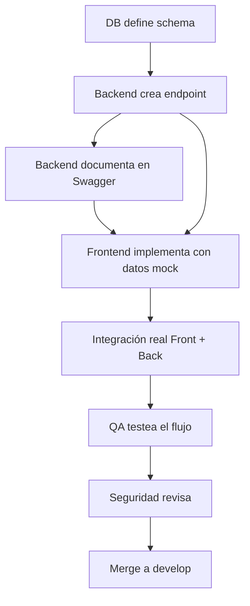

# 📊 DEVs PROJECT — Gestión del Proyecto

> Documento de planificación para la gestión, metodología y coordinación del equipo.

## 🏢 Metodología: Scrum Adaptado

Usamos **Scrum simplificado** con sprints de **2 semanas** y ceremonias reducidas para un equipo universitario.

### Ceremonias

| Ceremonia | Frecuencia | Duración | Propósito |
|-----------|------------|----------|-----------|
| **Sprint Planning** | Inicio de sprint | 1 hora | Seleccionar tareas del backlog |
| **Daily Standup** | Diario (async) | 5 min | Qué hice, qué haré, bloqueos |
| **Sprint Review** | Fin de sprint | 30 min | Demo de lo completado |
| **Retrospectiva** | Fin de sprint | 30 min | Qué mejorar, qué mantener |

> [!TIP]
> El **Daily Standup** puede ser **asíncrono** via un canal de Discord/Slack. Cada miembro posta un mensaje breve cada mañana.

## 👥 Estructura de Equipos

```
┌─────────────────────────────────────────────────┐
│              🐺 Project Lead / Scrum Master     │
│         Coordina, destraba, toma decisiones     │
└──────────┬──────────┬──────────┬────────────────┘
           │          │          │
    ┌──────▼──┐ ┌─────▼────┐ ┌──▼─────────┐
    │Frontend │ │ Backend  │ │ Base Datos │
    │ 2-3 p.  │ │ 2-3 p.   │ │ 1-2 p.     │
    └─────────┘ └──────────┘ └────────────┘
           │          │          │
    ┌──────▼──┐ ┌─────▼────┐ ┌──▼─────────┐
    │ Testing │ │Seguridad │ │  DevOps    │
    │ 1-2 p.  │ │ 1 p.     │ │ 1 p.       │
    └─────────┘ └──────────┘ └────────────┘
```

> [!NOTE]
> En un equipo universitario pequeño (5-8 personas), una persona puede cubrir múltiples roles. Por ejemplo: Backend + Seguridad, o Frontend + Testing.

### Roles sugeridos (equipo mínimo de 6)

| Persona | Rol Principal | Rol Secundario |
|---------|--------------|----------------|
| 1 | Project Lead / Scrum Master | Backend |
| 2 | Frontend Lead | — |
| 3 | Frontend | Testing |
| 4 | Backend Lead | Seguridad |
| 5 | Base de Datos | Backend |
| 6 | DevOps | Testing |

## 📅 Roadmap de Sprints

| Sprint | Período | Objetivos |
|--------|---------|-----------|
| **Sprint 0** | Semana 1-2 | Setup: Git, Docker, estructura, design system, schema DB |
| **Sprint 1** | Semana 3-4 | Auth completa + Landing page + Layout |
| **Sprint 2** | Semana 5-6 | Foro (categorías, hilos, respuestas, votos) + Búsqueda |
| **Sprint 3** | Semana 7-8 | Materiales (upload, download, preview) + Guías |
| **Sprint 4** | Semana 9-10 | Profesores + Ranking + Gamificación + Notificaciones |
| **Sprint 5** | Semana 11-12 | Admin panel + Moderación + Pulido + Deploy producción |
| **Sprint 6** | Semana 13-14 | Testing E2E + Bug fixing + Optimización + Launch 🚀 |

## 🗂️ Herramientas de Gestión

| Herramienta | Uso | Costo |
|-------------|-----|-------|
| **GitHub Projects** | Kanban board, issues, PRs | Gratis |
| **Discord** | Comunicación del equipo, standups async | Gratis |
| **Figma** | Diseños y prototipos UI | Gratis (edu) |
| **Notion / HackMD** | Documentación interna | Gratis |
| **GitHub Issues** | Tracking de bugs y features | Gratis |

### Board Kanban (GitHub Projects)

| Columna | Descripción |
|---------|-------------|
| 📋 **Backlog** | Todas las tareas pendientes |
| 🎯 **Sprint Actual** | Seleccionadas para este sprint |
| 🔵 **En Progreso** | Alguien está trabajando en esto |
| 🔍 **En Revisión** | PR abierto, esperando code review |
| ✅ **Hecho** | Mergeado a develop |

## 📏 Convenciones del Equipo

### Git Commits (Conventional Commits)
```
feat(auth): add login with JWT
fix(forum): fix vote duplication bug
docs(readme): update API endpoints
style(ui): adjust button hover colors
refactor(api): extract validation middleware
test(auth): add login integration tests
chore(docker): update nginx config
```

### Pull Requests
- **Título**: Seguir conventional commits
- **Descripción**: Qué cambia y por qué
- **Review**: Mínimo 1 reviewer antes de merge
- **Tests**: Deben pasar todas las checks de CI
- **Branch**: Siempre desde `develop`, nunca `main`

### Code Review Checklist
- [ ] ¿El código es legible y tiene nombres descriptivos?
- [ ] ¿Hay validación de inputs?
- [ ] ¿Se manejan los errores correctamente?
- [ ] ¿Hay tests para la funcionalidad nueva?
- [ ] ¿No hay contraseñas o secrets en el código?
- [ ] ¿Se sigue la estructura de archivos del proyecto?

## 🔄 Flujo de Trabajo entre Equipos

### Cómo coordinar Frontend ↔ Backend



1. **DB** define el modelo y migra
2. **Backend** crea el endpoint y lo documenta en Swagger
3. **Frontend** empieza con datos mock basados en el contrato de API
4. Cuando el endpoint está listo, **integran** y prueban juntos
5. **QA** testea el flujo completo
6. **Seguridad** revisa antes del merge final

### Comunicación de Bloqueos

Si una tarea está bloqueada por otro equipo:
1. Crear un **Issue** en GitHub etiquetado `blocked`
2. Mencionar al equipo responsable en Discord
3. Si es urgente, escalar al Project Lead
4. Mientras tanto, trabajar en tareas que no están bloqueadas

## 📋 Tareas de Gestión

| # | Tarea | Tipo | Dependencias |
|---|-------|------|--------------|
| PM-001 | Crear repositorio Git con ramas | 🔵 Solo | — |
| PM-002 | Configurar GitHub Projects (Kanban) | 🔵 Solo | PM-001 |
| PM-003 | Crear servidor Discord con canales por equipo | 🔵 Solo | — |
| PM-004 | Crear Issues para Sprint 0 completo | 🔵 Solo | PM-002 |
| PM-005 | Definir asignación de roles del equipo | 🟠 Conjunto (todo el equipo) | — |
| PM-006 | Hacer Sprint Planning del Sprint 0 | 🟠 Conjunto (todo el equipo) | PM-004 |
| PM-007 | Configurar templates de Issues y PRs | 🔵 Solo | PM-001 |
| PM-008 | Escribir CONTRIBUTING.md | 🔵 Solo | — |

## 🔑 Leyenda

| 🔵 Solo | 🟠 Conjunto |
|---------|-------------|
| Independiente | Coordinación con el equipo |

---
*📅 Última actualización: Julio 2026*
